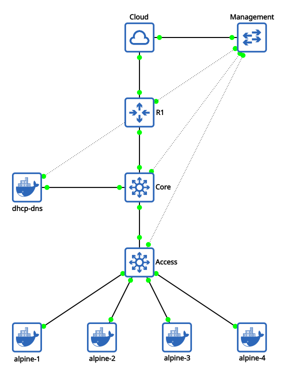

# Layer 3 Inter-VLAN Routing Lab

This topology illustrates a multi-tier network architecture with a CiscoIoSv router and two Cisco IOSvL2 switches. The setup implements Inter-VLAN routing and infrastructure services (DHCP/DNS) at Layer 3 along with out-of-band management connectivity.

---

## Network Topology Diagram

<p align="center">
  
</p>

---

## Automation of Topology Configuration

### Port Mapping

> The following port mappings are strictly required for the automation playbook to correctly identify and configure interfaces. Ensure the various links match this table exactly.

<div align="center">

| **Source Node** |   **Source Port**    | **Target Node** |   **Target Port**    |
| :-------------- | :------------------: | :-------------- | :------------------: |
| **Management**  |     `Ethernet0`      | **Cloud**       |      `br-mgmt`       |
| **Management**  |     `Ethernet1`      | **R1**          | `GigabitEthernet0/0` |
| **Management**  |     `Ethernet2`      | **Core**        | `GigabitEthernet0/0` |
| **Management**  |     `Ethernet3`      | **Access**      | `GigabitEthernet0/0` |
| **Management**  |     `Ethernet4`      | **dhcp-dns**    |        `eth1`        |
|                 |                      |                 |                      |
| **R1**          | `GigabitEthernet0/1` | **Cloud**       |       `virbr0`       |
| **R1**          | `GigabitEthernet0/2` | **Core**        | `GigabitEthernet0/1` |
|                 |                      |                 |                      |
| **Core**        | `GigabitEthernet0/2` | **Access**      | `GigabitEthernet0/1` |
| **Core**        | `GigabitEthernet3/3` | **dhcp-dns**    |        `eth0`        |

</div>

### Automation Prerequisites

- All nodes must have their management interfaces connected to the **Management Switch** to allow SSH access for automation agents.
- [Boostrap configurations](./bootstrap.md) for all nodes should be applied.
- Ensure ssh config is configured to allow the outdated algorithms used by the cisco images.

### Run the Playbook

Deploy the full configuration via Ansible:

```
ansible-playbook -i hosts.ini playbooks/deploy_lab.yml
```

---

## Technical Explanation

### 1. Routing & Switching Hierarchy

The network follows a classic three-tier approach (collapsed Core/Distribution):

- **Edge (R1)**: This router is responsible for handling NAT/PAT to provide internet access to the internal networks via the Cloud node.

- **Core Switch (Core)**: It is a Cisco IOSvL2 switch configured as an L3 device. It handles Inter-VLAN routing using Switched Virtual Interfaces (SVIs). Each of these interfaces act as default gateways for the end users and also have helper addresses configured to point to the DHCP server.

- **Access Switch (Access)**: It is a Cisco IOSvL2 switch which separates the traffic into various VLANs before passing it to the `Core`. The ports connecting `Core` and `Access` are both configured to be trunk ports so as to carry the VLANs across.

- **DHCP/DNS Server (dhcp-dns)**: It is an alpine linux machine using dnsmasq to dynamically provide IP addresses based on the VLAN. It also acts as a DNS server, allowing the end users to communicate with each other on a local domain.

### 2. Services & Management Plane

- **DHCP/DNS Server (dhcp-dns)**: It is an alpine linux machine using dnsmasq to dynamically provide IP addresses based on the VLAN. It also acts as a DNS server, allowing the end users to communicate with each other on a local domain.

- **OOB Management**: A dedicated management switch connects to the management interface of every device. This ensures that changes in configuration do not affect how Ansible manages the nodes.

---

## Shortcomings & Future Considerations

### Current Limitations

- **Hairpinning:** Traffic between two devices in the same VLAN (or even different VLANs on the same Access switch) must travel up the trunk link to the `Core` switch to be routed/switched and then come right back down the same physical path. This wastes bandwidth on the Core uplink and increases latency.

* **Lack of Path Redundancy:** Although STP is configured (with PortFast for instant link availability), the protocol is effectively "dormant" regarding failover. Because there are no redundant physical links between switches, there is no opportunity to test STP convergence.

### Next Topology Goals

- **Dynamic Routing**: Transition from static routes to **OSPF (Open Shortest Path First)**.
- **Link Redundancy**: Implement redundancy between router and cores so that if one link fails, the link to the remaining core is used.
