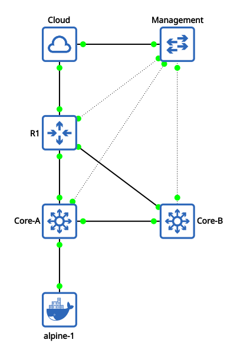

# Dynamic Routing with OSPF

This topology illustrates a link redundant network architecture with a CiscoIoSv router and two Cisco IOSvL2 switches. The setup implements OSPF with link redundancy between the router and the cores along with out-of-band management connecvitivity.

---

## Network Topology Diagram

<p align="center">
  
</p>

---

## Automation of Topology Configuration

### Port Mapping

> The following port mappings are strictly required for the automation playbook to correctly identify and configure interfaces. Ensure the various links match this table exactly.

<div align="center">

| **Source Node** |   **Source Port**    | **Target Node** |   **Target Port**    |
| :-------------- | :------------------: | :-------------- | :------------------: |
| **Management**  |     `Ethernet0`      | **Cloud**       |      `br-mgmt`       |
| **Management**  |     `Ethernet1`      | **R1**          | `GigabitEthernet0/0` |
| **Management**  |     `Ethernet2`      | **Core_A**      | `GigabitEthernet0/0` |
| **Management**  |     `Ethernet3`      | **Core_B**      | `GigabitEthernet0/0` |
|                 |                      |                 |                      |
| **R1**          | `GigabitEthernet0/1` | **Cloud**       |       `virbr0`       |
| **R1**          | `GigabitEthernet0/2` | **Core_A**      | `GigabitEthernet0/1` |
| **R1**          | `GigabitEthernet0/3` | **Core_B**      | `GigabitEthernet0/1` |
|                 |                      |                 |
| **Core_A**      | `GigabitEthernet0/2` | **Core_B**      | `GigabitEthernet0/2` |

</div>

### Automation Prerequisites

- All nodes must have their management interfaces connected to the **Management Switch** to allow SSH access for automation agents.
- [Boostrap configurations](./bootstrap.md) for all nodes should be applied.
- Ensure ssh config is configured to allow the outdated algorithms used by the cisco images.

### Run the Playbook

Deploy the full configuration via Ansible:

```
ansible-playbook -i hosts.ini playbooks/deploy_lab.yml
```

---

## Technical Explanation

### 1. Routing & Switching Hierarchy

This network implements a collapsed core architecture where link redundancy is acheived. :

- **Edge (R1)**: This router is responsible for handling NAT/PAT to provide internet access to the internal networks via the Cloud node.

- **Core Switches (Core_A & Core_B)**: Two Cisco IOSvL2 switches operating as Layer 3 devices.
  - **Core_A** has an SVI for VLAN 10 which acts as the default gateway for the clients.

  - **Core_B** provides a redundant path to Core_A. It ensures that the router can still reach the clients even if the direct link to Core_A fails.

### 2. Dynamic Routing & Redundancy

- **OSPF Area**: All links are configured in area 0.

- **Default Route Propagation**: R1 is configured with `default-information originate`. In this manner, R1 advertises itself as the default gateway to both the Core switches.

- **Core Connectivity**: A dedicated link is set up between **Core_A** and **Core_B** so as to allow OSPF to recalculate paths when a router-to-core link is lost.

### 3. Services & Management Plane

- **OOB Management**: A dedicated management switch connects to the management interface of every device. This ensures that changes in configuration do not affect how Ansible manages the nodes.

---

## Shortcomings & Future Considerations

### Current Limitations

- **Single Point of Failure**: Although there is link redundancy at the routing level, the clients are connected only to Core_A. If Core_A itself fails, the clients lose their default gateway even if Core_B is still active.

- **LSA Flooding**: All links are configured to be in area 0 of OSPF. This means that every topology change triggers **Link State Advertisements (LSA)** across the entire network. On larger topologies, this can cause LSA flooding and very large routing tables.

### Next Topology Goals

- **Spine-Leaf Architecture**: Transition to a design where every leaf (Access) is connected to every spine (Core). This would ensure that there are equal-cost paths to every spine and complete redundancy at the core layer.

- **High Availability (FHRP)**: Implement **FHRP** (First Hop Redundancy Protocol) through either **HSRP** or **VRRP** on the inter-core links. This would ensure that a virtual IP remains active as the gateway even if a core fails.

- **Multi OSPF Areas**: Limit the scope of LSA and optimise the Link State Database (LSDB) through OSPF area segmentation.
